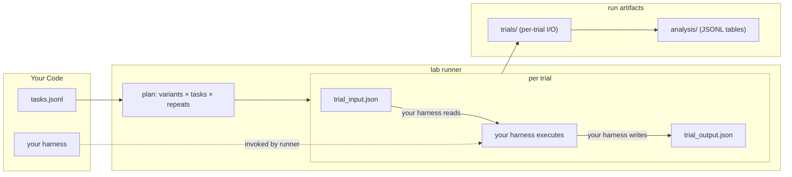

# AgentLab

Experiment runner for agent and trainer systems. Runs **your code** against a dataset with explicit A/B variant plans, then collects structured results into analysis tables.

## What You Provide

### 1. A dataset (`tasks.jsonl`)

JSONL file. Each line is one task the runner feeds to your harness.

```jsonl
{"task_id": "task_001", "prompt": "Write a function that reverses a string", "language": "python"}
{"task_id": "task_002", "prompt": "Implement binary search", "language": "python"}
```

The shape of each task is up to you — the runner passes it through verbatim. Only `task_id` is required.

### 2. A harness (your program)

Your executable that does the actual work. The runner invokes it once per trial. It reads `trial_input.json` (containing the task, variant bindings, and IDs) and writes `trial_output.json` (containing your result and outcome).

```
your-harness --input /out/trial_input.json --output /out/trial_output.json
```

The harness is entirely yours — a Node script, a Python module, a compiled binary. AgentLab doesn't care how it works internally.

### 3. An experiment config (`experiment.yaml`)

Ties it all together: which dataset, which harness command, how many repeats, what variants to compare, and what isolation posture to use. Lives at `.lab/experiment.yaml`.

---

## How It Works



For each trial:

1. Runner copies your project into an isolated workspace (container or local).
2. Writes `trial_input.json` with the task data, variant bindings, and run/trial IDs.
3. Invokes your harness command.
4. Collects `trial_output.json`.
5. After all trials, builds analysis tables under `.lab/runs/<run_id>/analysis/`.

**Container mode** copies your project into a Docker container and runs your harness there. The runner does not build images — you provide a pre-built image via `runtime.sandbox.image` in your experiment config or `sandboxImage()` in the SDK. If no image is set, trials run locally.

---

## TypeScript SDK

The SDK is the primary programmatic interface. It provides a builder for experiment configs and a typed client that drives the Rust runner binary.

```bash
cd sdk && npm install && npm run build
```

### Build an experiment

```ts
import { ExperimentBuilder, LabClient } from '@agentlab/sdk';
import { writeFileSync, mkdirSync } from 'node:fs';

const builder = ExperimentBuilder.create('prompt_ab', 'Prompt A/B Test')
  .description('Compare prompt v1 vs v2 on coding tasks')

  // --- dataset ---
  // Path is relative to your project root (the parent of .lab/).
  .datasetJsonl('./data/tasks.jsonl', {
    suiteId: 'coding_tasks',
    splitId: 'dev',
    limit: 50,
  })

  // --- harness command ---
  // This is YOUR program. The runner invokes it for each trial.
  // Path is relative to your project root.
  //
  //   Node:   ['node', './src/harness/run-trial.js']
  //   Python: ['python', '-m', 'my_agent.harness']
  //   Binary: ['./bin/evaluate']
  //
  // If this path is wrong, every trial fails. Use `lab describe` to verify
  // the resolved path before running.
  .harnessCli(
    ['node', './src/harness/run-trial.js'],
    { integrationLevel: 'cli_events' }
  )

  // --- experiment design ---
  .sanitizationProfile('hermetic_functional_v2')
  .replications(3)
  .randomSeed(42)

  // --- variants (what you're comparing) ---
  .baseline('control', { model: 'gpt-4o', temperature: 0.0 })
  .addVariant('treatment', { model: 'gpt-4o', temperature: 0.7 })

  // --- analysis ---
  .primaryMetrics(['success', 'accuracy'])
  .secondaryMetrics(['latency_ms', 'cost_usd'])

  // --- isolation ---
  // 'none': no network (default, strictest)
  // 'full': unrestricted network
  // 'allowlist_enforced': only listed hosts
  .networkMode('allowlist_enforced', ['api.openai.com']);

// Write to disk
mkdirSync('.lab', { recursive: true });
writeFileSync('.lab/experiment.yaml', builder.toYaml());

// Run it
const client = new LabClient();
const summary = await client.describe({ experiment: '.lab/experiment.yaml' });
console.log(`Planned: ${summary.summary.total_trials} trials`);

const run = await client.runExperiment({ experiment: '.lab/experiment.yaml' });
console.log(`Done: ${run.run.run_id}`);
```

### What `harnessCli` means

The `command` array is what the runner executes for every trial. It runs from your **project root** (the parent directory of `.lab/`).

| Your stack | Command array | What the runner executes |
|---|---|---|
| Node script | `['node', './src/harness/run-trial.js']` | `node ./src/harness/run-trial.js` |
| Python module | `['python', '-m', 'my_agent.harness']` | `python -m my_agent.harness` |
| Shell script | `['bash', './scripts/evaluate.sh']` | `bash ./scripts/evaluate.sh` |
| Compiled binary | `['./bin/evaluate']` | `./bin/evaluate` |

The `integrationLevel` controls how much telemetry your harness emits:

| Level | What it means |
|---|---|
| `cli_basic` | Harness reads input, writes output. No events. |
| `cli_events` | Harness also writes `harness_events.jsonl` with step/turn events. |
| `otel` | Events via OpenTelemetry spans. |
| `sdk_control` | Harness reads the control plane file for pause/stop signals. |
| `sdk_full` | Full bidirectional control. |

### LabClient

Typed client that spawns the Rust `lab` binary and parses JSON responses.

```ts
const client = new LabClient({
  runnerBin: '/path/to/lab',   // or set AGENTLAB_RUNNER_BIN env var
  cwd: '/your/project/root',   // defaults to process.cwd()
  env: { OPENAI_API_KEY: '...' },
});
```

| Method | Description |
|---|---|
| `client.describe(args)` | Dry-run: shows planned trials without executing |
| `client.run(args)` | Run with optional container mode |
| `client.runDev(args)` | Dev run: full network access, optional setup command |
| `client.runExperiment(args)` | Strict run: requires network mode `none` |
| `client.replay(args)` | Replay a prior trial from run artifacts |
| `client.fork(args)` | Fork a trial at a checkpoint |
| `client.pause(args)` | Pause a running trial at next safe boundary |
| `client.resume(args)` | Resume a paused trial |
| `client.publish(args)` | Create debug bundle from a run |
| `client.validateKnobs(args)` | Validate parameter overrides against manifest |
| `client.validateHooks(args)` | Validate event stream against harness manifest |
| `client.validateSchema(args)` | Validate JSON file against schema |

All commands throw `LabRunnerError` on failure with `code`, `message`, `details`, `exitCode`, `stderr`, and `command` fields.

See [`sdk/README.md`](sdk/README.md) for full API reference and type exports.

---

## Rust CLI

The `lab` binary is the execution engine. The SDK calls it under the hood — you can also use it directly.

### Build

```bash
cd rust && cargo build -p lab-cli --release
```

Symlink into your project:

```bash
ln -sf /path/to/agentlab/rust/target/release/lab-cli ./lab
```

### First Run

```bash
# 1. Generate skeleton config
./lab init

# 2. Fill in all fields marked REQUIRED
$EDITOR .lab/experiment.yaml

# 3. Validate — shows resolved trial plan and checks harness path
./lab describe .lab/experiment.yaml

# 4. Run
./lab run .lab/experiment.yaml
```

`lab describe` is your pre-flight check. It prints the resolved harness command, whether the harness script exists, the number of planned trials, and the effective network/container mode. **Run it before every experiment.**

### Commands

| Command | What it does |
|---|---|
| `init` | Write skeleton `.lab/experiment.yaml` |
| `describe <experiment>` | Dry-run: show resolved config and trial plan |
| `run <experiment>` | Execute trials (pass `--container` for container mode) |
| `run-dev <experiment>` | Execute with full network access + optional `--setup` command |
| `run-experiment <experiment>` | Strict execution: requires network mode `none` |
| `replay --run-dir <dir> --trial-id <id>` | Re-execute a trial from artifacts |
| `fork --run-dir <dir> --from-trial <id> --at <selector>` | Fork at checkpoint with `--set k=v` overrides |
| `pause --run-dir <dir>` | Cooperative pause at next safe boundary |
| `resume --run-dir <dir>` | Resume a paused trial |
| `publish --run-dir <dir>` | Create debug bundle |
| `knobs-init` | Generate parameter override manifest and overrides file |
| `knobs-validate` | Validate overrides against manifest |
| `clean --init` / `clean --runs` | Remove generated files or run directories |

Most commands accept `--overrides <path>` for parameter overrides and `--json` for machine-readable output.

### JSON Machine Mode

Commands that accept `--json` emit exactly one JSON object to stdout. No human text, no progress output — just structured data.

```bash
./lab describe .lab/experiment.yaml --json
./lab run-experiment .lab/experiment.yaml --json
```

Success: `{ "ok": true, "command": "describe", "summary": { ... } }`

Error: `{ "ok": false, "error": { "code": "command_failed", "message": "...", "details": {} } }`

This is what the SDK parses internally. You can also consume it from any language.

---

## Run Modes

Three commands run trials. They differ in network posture and intended use:

| Command | Network | Container | Purpose |
|---|---|---|---|
| `run` | As configured | `--container` flag (default: local) | General purpose |
| `run-dev` | Forced to `full` | Forced on | Iteration: install deps with `--setup`, full network access |
| `run-experiment` | Must be `none` | Forced on | Production: strict isolation, reproducible results |

**`run`** respects whatever network and sandbox mode you configured. Use this for local development without Docker.

**`run-dev`** overrides network mode to `full` and forces container mode. The `--setup` flag runs a command before trials (e.g., `--setup "npm ci"` to install dependencies inside the container). Use this when your harness needs to fetch dependencies or call external APIs during development.

**`run-experiment`** requires network mode `none` and forces container mode. If your experiment config has any other network mode, it refuses to run. Use this for final experiment execution where reproducibility matters.

---

## Parameter Overrides (Knobs)

Knobs are a structured way to tweak experiment config without editing YAML by hand.

**The problem:** Your experiment.yaml has values like `replications: 3` and `network.mode: none`. You want to run a quick test with `replications: 1` without changing the canonical config file.

**The solution:** A knob manifest declares which fields are tunable, their types, and their allowed ranges. An overrides file sets specific values. The runner applies overrides to the experiment config before execution.

### Setup

```bash
# Generate manifest + overrides files
./lab knobs-init

# Edit: declare which fields are tunable
$EDITOR .lab/knobs/manifest.json

# Edit: set override values
$EDITOR .lab/knobs/overrides.json

# Validate overrides against manifest
./lab knobs-validate

# Run with overrides
./lab run .lab/experiment.yaml --overrides .lab/knobs/overrides.json
```

### How it works

The **manifest** (`.lab/knobs/manifest.json`) declares knobs:

```json
{
  "knobs": [
    {
      "id": "design.replications",
      "json_pointer": "/design/replications",
      "type": "integer",
      "minimum": 1,
      "maximum": 100,
      "role": "core",
      "scientific_role": "control"
    }
  ]
}
```

The **overrides** file (`.lab/knobs/overrides.json`) sets values:

```json
{
  "manifest_path": ".lab/knobs/manifest.json",
  "values": {
    "design.replications": 1
  }
}
```

The runner validates that each override ID exists in the manifest, the value matches the declared type, and it falls within declared bounds. If validation fails, the run aborts.

Knobs can be classified by `role` (`core`, `harness`, `benchmark`, `infra`) and `scientific_role` (`treatment`, `control`, `confound`, `invariant`). This lets UIs render appropriate controls and analysis to track which parameters were varied.

### From the SDK

```ts
await client.validateKnobs({
  manifest: '.lab/knobs/manifest.json',
  overrides: '.lab/knobs/overrides.json',
});

// Pass overrides to any run command
await client.run({
  experiment: '.lab/experiment.yaml',
  overrides: '.lab/knobs/overrides.json',
});
```

---

## Run Artifacts

Each run produces a directory at `.lab/runs/<run_id>/` with:

```
.lab/runs/run_20260210_143022/
  manifest.json                      # run metadata (runner version, timestamps)
  resolved_experiment.json           # final experiment config after overrides
  resolved_experiment.digest         # SHA-256 of resolved config
  trials/
    trial_1/
      trial_input.json               # what the runner passed to your harness
      trial_output.json              # what your harness returned
      workspace/                     # copy of your project (harness ran here)
      state/                         # pre/post state snapshots
      out/                           # harness I/O directory
    trial_2/
      ...
  analysis/
    tables/
      trials.jsonl                   # one row per trial (outcome, duration, variant, task)
      metrics_long.jsonl             # one row per (trial, metric) pair
      event_counts_by_trial.jsonl    # hook event counts per trial
      event_counts_by_variant.jsonl  # hook event counts per variant
      variant_summary.jsonl          # aggregate stats per variant
      load_duckdb.sql                # DDL to load all tables into DuckDB
  attestation.json                   # provenance attestation
```

### Analytics with DuckDB

```bash
cd .lab/runs/<run_id>/analysis
duckdb agentlab.duckdb < tables/load_duckdb.sql
```

```sql
-- success rate by variant
SELECT variant_id, COUNT(*) as trials,
       SUM(CASE WHEN outcome = 'success' THEN 1 ELSE 0 END) as successes
FROM trials GROUP BY variant_id;
```

---

## Pathing

The single most common source of failures is wrong paths. Here's how resolution works:

**Project root:** The parent directory of `.lab/`. If your experiment is at `.lab/experiment.yaml`, the project root is the directory containing `.lab/`.

**Harness command:** Resolved relative to the project root. If your config says `command: ['node', './src/harness/run-trial.js']`, the runner looks for `<project_root>/src/harness/run-trial.js`.

**Dataset path:** Resolved relative to the directory containing `experiment.yaml`. If your config is `.lab/experiment.yaml` and says `path: ../data/tasks.jsonl`, it resolves to `<project_root>/data/tasks.jsonl`.

**Debug pathing issues:**

```bash
# Shows resolved harness path and whether the file exists
./lab describe .lab/experiment.yaml
```

Look for `harness_script_resolved` and `harness_script_exists` in the output. If the file doesn't exist, fix the `runtime.harness.command` path in your experiment config.

### Workload Types

Set `experiment.workload_type` in your config:

- **`agent_harness`** — Standard agent evaluation. Harness runs an agent, reports outcome.
- **`trainer`** — Training workload. Harness reports `objective` (name, value, direction) and training metrics (`train_loss`, `val_acc`, `wall_time_s`). Optional checkpoint reporting.
