# AgentLab

Experiment runner for agent and trainer systems. Runs **your code** against a dataset with explicit A/B variant plans, then collects structured results into analysis tables.

Container execution is the primary mode: trials run in a configured container image, while the runner owns scheduling, evidence capture, and benchmark wiring.

## Primary SDK Boundaries (You Implement These)

These are the boundaries you own in your SDK script:

1. `InputMapper<TRaw> -> TaskBoundaryV1`
2. `OutcomeMapper<TDomain> <- OutcomeBoundaryV1`

Everything else is runner-owned and benchmark-adapter-owned:

- Runner orchestration, container/process execution, evidence capture, chain state, retry/scheduling.
- Benchmark adapter/evaluator prediction + scoring semantics.
- Analysis aggregation and comparisons.

`TaskBoundaryV1` is intentionally fixed:

- `task`
- `workspace_files`
- `mount_references`
- `limits`

If inputs cannot compile into that, it is a new runner capability request, not a new task boundary type.

## What You Provide

### 1. Raw dataset rows

Any shape you want (JSONL, DB rows, in-memory objects). Your `InputMapper` compiles each row into `task_boundary_v1`.

### 2. `InputMapper` (SDK implementation)

Your mapper from raw row -> runner-consumable task boundary. This is your input-side boundary implementation.

### 3. A harness runtime + command

Your executable does the work. Runner invokes it as an external API surface and captures what it emits (stdout/stderr/output/events/filesystem effects).

### 4. `OutcomeMapper` (SDK implementation)

Your mapper from runner-emitted `OutcomeBoundaryV1` -> your domain outcome shape (for grader/reporting/business logic).

### 5. An experiment config (`experiment.yaml`)

Built with `ExperimentBuilder` and written to `.lab/experiment.yaml`.

---

## How It Works (Boundary-First, Container-Primary)

```mermaid
flowchart LR
  subgraph build [" Build boundary (SDK script) "]
    TASKS["tasks.jsonl / source rows"]
    IM["InputMapper (user-implemented)"]
    SPEC["ExperimentSpec + task_boundary_v1 rows"]
    TASKS --> IM --> SPEC
  end

  subgraph run [" Run boundary (Runner) "]
    direction TB
    PLAN["plan variants x tasks x reps"]
    PREP["prepare trial dirs + stage workspace"]
    INPUT["build trial_input_v1"]
    EXEC["invoke one harness command"]
    EVID["write evidence_record_v1 / task_chain_state_v1"]
    PLAN --> PREP --> INPUT --> EXEC --> EVID
  end

  subgraph container [" Container execution contract "]
    HRI["Harness Runtime Image (runtime.sandbox.image)"]
    MOUNTS["mounts: /workspace rw, /harness ro, /dataset ro, /state rw, /out rw, /tmp tmpfs"]
    API["harness I/O surface: stdin + env vars + stdout/stderr + optional trial_output"]
    HRI --> MOUNTS --> API
  end

  subgraph benchmark [" Benchmark boundary (Adapter/Evaluator) "]
    PRED["predictions.jsonl"]
    SCORES["scores.jsonl (canonical verdicts)"]
    BMSUM["benchmark/summary.json"]
    PRED --> SCORES --> BMSUM
  end

  subgraph post [" Post-run boundary (SDK script) "]
    RR["RunResponse {run_id, run_dir, artifacts}"]
    OM["OutcomeMapper (user-implemented)"]
    GR["grader/report consumer"]
    RR --> OM --> GR
  end

  SPEC --> PLAN
  INPUT --> API
  API --> EVID
  EVID --> PRED
  BMSUM --> RR
```



### Build vs Run Boundary

- Build (SDK): compiles static artifacts only (`ExperimentSpec` + dataset/task boundary rows). No harness execution, no scoring, no mutable runtime state.
- Run (Runner): consumes static artifacts and produces trial artifacts, evidence records, benchmark outputs, and analysis tables.

### Per-Trial Runtime Boundary (Actual Runner Behavior)

1. Runner creates `.lab/runs/<run_id>/trials/<trial_id>/{workspace,state,dataset,out,tmp}`.
2. Runner stages `workspace/` by copying project files from experiment root (filtered excludes like `.lab`, `.git`, `node_modules`, virtualenv/cache/build dirs).
3. Runner materializes task boundary payload:
   - writes `workspace_files` into `workspace/`.
   - resolves `mount_references` to `.lab/dataset_packs/sha256/<digest>` (container mode required).
4. Runner builds `trial_input_v1` and writes canonical `trial_input.json` with IDs, task, bindings, runtime paths, and optional `ext.task_boundary_v1`.
5. Runner invokes exactly one harness command.
   - Container mode mounts: `/workspace` (rw), `/harness` (ro project root), `/dataset` (ro), `/state` (rw), `/out` (rw), `/tmp` (tmpfs).
   - Runner launches the child process with env vars: `AGENTLAB_TRIAL_INPUT`, `AGENTLAB_TRIAL_OUTPUT`, `AGENTLAB_CONTROL_PATH`, `AGENTLAB_HARNESS_ROOT`.
6. Runner resolves trial output deterministically:
   - if output file exists at `AGENTLAB_TRIAL_OUTPUT`, uses it.
   - else if last non-empty stdout line is JSON, writes that as `trial_output.json`.
   - else synthesizes an error `trial_output_v1`.
   - Harness code can ignore those env vars entirely if it already supports stdin/stdout JSON.
7. Runner captures evidence: stdout/stderr, optional events ref, workspace pre/post snapshots, incremental+cumulative diffs, derived patches, timing/executor metadata.
8. Runner appends run-scope evidence boundaries:
   - `.lab/runs/<run_id>/evidence/evidence_records.jsonl`
   - `.lab/runs/<run_id>/evidence/task_chain_states.jsonl`
9. Runner invokes benchmark adapter/evaluator (when configured) to write:
   - `.lab/runs/<run_id>/benchmark/predictions.jsonl`
   - `.lab/runs/<run_id>/benchmark/scores.jsonl`
   - `.lab/runs/<run_id>/benchmark/summary.json`
10. Analysis consumes trial tables plus benchmark score records (when present) as canonical verdicts.

### Harness Runtime Image (HRI)

Container mode expects a user-supplied image at `runtime.sandbox.image` (or `.sandboxImage(...)` in SDK). The runner does not build images.

- Recommended for immutability: pin by digest (`repo/image@sha256:...`) rather than mutable tags.
- Typical HRI contents: runtime + dependencies. Harness code can come from `/harness` read-only mount.
- Fully baked harness is also supported: if your command points to an executable inside the image, you can avoid dependence on mounted source paths.

---

## TypeScript SDK

The SDK is the primary programmatic interface. It provides a builder for experiment configs and a typed client that drives the Rust runner binary.

```bash
cd sdk && npm install && npm run build
```

### Build + Run (Boundary-First Example)

```ts
import {
  ExperimentBuilder,
  LabClient,
  Metric,
  compileTaskBoundaries,
  taskBoundariesToJsonl,
  createOutcomeBoundary,
  mapOutcome,
  type HookEvent,
  type InputMapper,
  type OutcomeMapper,
  type TrialOutput,
} from '@agentlab/sdk';
import { mkdirSync, readFileSync, writeFileSync } from 'node:fs';

// ------------------------------------------------------------------
// 1) Input boundary you implement: InputMapper<RawRow> -> TaskBoundaryV1
// ------------------------------------------------------------------
type RawRow = {
  id: string;
  prompt: string;
  repo: string;
};

const rawRows: RawRow[] = [
  { id: 'task_001', prompt: 'Fix failing tests in parser', repo: 'acme/parser' },
  { id: 'task_002', prompt: 'Implement cache invalidation bugfix', repo: 'acme/cache' },
];

const inputMapper: InputMapper<RawRow> = {
  map(row, { index }) {
    return {
      schema_version: 'task_boundary_v1',
      task: {
        id: row.id,
        prompt: row.prompt,
        repo: row.repo,
        index,
      },
      workspace_files: [],
      mount_references: [],
      limits: {
        max_steps: 32,
        trial_seconds: 300,
      },
    };
  },
};

const taskBoundaries = compileTaskBoundaries(rawRows, inputMapper);

// experiment.yaml lives in .lab/, so dataset path below is relative to .lab/
mkdirSync('.lab/data', { recursive: true });
writeFileSync('.lab/data/tasks.boundary.jsonl', taskBoundariesToJsonl(taskBoundaries));

// ------------------------------------------------------------------
// 2) Build ExperimentSpec boundary with ExperimentBuilder
// ------------------------------------------------------------------
const builder = ExperimentBuilder.create('prompt_ab', 'Prompt A/B Test')
  .description('Boundary-first SDK example')
  .datasetJsonl('./data/tasks.boundary.jsonl', {
    suiteId: 'boundary_demo',
    splitId: 'dev',
    limit: taskBoundaries.length,
  })
  .harnessCli(['node', './src/harness/run-trial.js'], {
    integrationLevel: 'cli_events',
  })
  .baseline('control', { model: 'gpt-4o', temperature: 0.0 })
  .addVariant('treatment', { model: 'gpt-4o', temperature: 0.7 })
  .metric(Metric.DURATION_MS)
  .metric(Metric.TOKENS_IN)
  .metric(Metric.TOKENS_OUT)
  .metric(Metric.fromOutput('success', '/outcome', {
    primary: true,
    direction: 'maximize',
  }))
  .networkMode('none')
  .sandboxImage('ghcr.io/your-org/your-harness-runtime@sha256:...');

mkdirSync('.lab', { recursive: true });
writeFileSync('.lab/experiment.yaml', builder.toYaml());

const client = new LabClient();
const run = await client.run({ experiment: '.lab/experiment.yaml' });
console.log(`run_id=${run.run.run_id}`);
console.log(`run_dir=${run.run.run_dir}`);

// ------------------------------------------------------------------
// 3) Outcome boundary you implement: OutcomeBoundaryV1 -> DomainOutcome
// ------------------------------------------------------------------
const outcomeMapper: OutcomeMapper<{
  taskId: string;
  pass: boolean;
  tokensIn: number;
}> = {
  map(boundary) {
    const tokensIn = boundary.run_events
      .filter((e) => e.event_type === 'model_call_end')
      .reduce((sum, e) => sum + (e.usage?.tokens_in ?? 0), 0);
    return {
      taskId: boundary.result_summary.ids.task_id,
      pass: boundary.result_summary.outcome === 'success',
      tokensIn,
    };
  },
};

const evidence = await client.readEvidence({ runDir: run.run.run_dir });
// For brevity this maps only the first trial. In production, loop all evidence rows.
const firstTrialId = evidence.evidence[0]?.ids.trial_id;
if (!firstTrialId) {
  throw new Error('No trials recorded');
}

const trialDir = `${run.run.run_dir}/trials/${firstTrialId}`;
const trialOutput = JSON.parse(
  readFileSync(`${trialDir}/trial_output.json`, 'utf8'),
) as TrialOutput;

let runEvents: HookEvent[] = [];
try {
  runEvents = readFileSync(`${trialDir}/state/harness_events.jsonl`, 'utf8')
    .split('\n')
    .map((line) => line.trim())
    .filter(Boolean)
    .map((line) => JSON.parse(line) as HookEvent);
} catch {
  runEvents = [];
}

const domainOutcome = await mapOutcome(
  createOutcomeBoundary(trialOutput, runEvents),
  outcomeMapper,
);
console.log(domainOutcome);
```

Boundary intuition for this example:

- `InputMapper` is the only place raw dataset semantics are translated into runner task boundaries.
- `ExperimentBuilder` defines execution/scientific policy, not benchmark verdict logic.
- Runner executes and captures evidence; it returns run-scope metadata (`RunResponse`) when the experiment is done.
- `OutcomeMapper` is the only place runner-emitted boundaries are translated into your domain outcome model.

### What `harnessCli` means

The `command` array is what the runner executes for every trial. Resolution is mode-specific:

- Local mode: path-like command args are resolved to host absolute paths under your project root.
- Container mode: path-like command args are remapped to `/harness/...` (read-only mount of project root).
- Working directory is mutable trial workspace (`<trial>/workspace` on host, `/workspace` in container).

| Your stack | Command array | Local mode resolution | Container mode resolution |
|---|---|---|---|
| Node script | `['node', './src/harness/run-trial.js']` | `node /abs/project/src/harness/run-trial.js` | `node /harness/src/harness/run-trial.js` |
| Python module | `['python', '-m', 'my_agent.harness']` | `python -m my_agent.harness` | `python -m my_agent.harness` |
| Shell script | `['bash', './scripts/evaluate.sh']` | `bash /abs/project/scripts/evaluate.sh` | `bash /harness/scripts/evaluate.sh` |
| Compiled binary | `['./bin/evaluate']` | `/abs/project/bin/evaluate` | `/harness/bin/evaluate` |

The `integrationLevel` controls how much telemetry your harness emits:

| Level | What it means |
|---|---|
| `cli_basic` | Harness reads input, writes output. No events. |
| `cli_events` | Harness also writes `harness_events.jsonl` with step/turn events. |
| `otel` | Events via OpenTelemetry spans. |
| `sdk_control` | Harness reads the control plane file for pause/stop signals. |
| `sdk_full` | Full bidirectional control. |

### LabClient

Typed client that spawns the Rust `lab` binary and parses JSON responses.

```ts
const client = new LabClient({
  runnerBin: '/path/to/lab',   // or set AGENTLAB_RUNNER_BIN env var
  cwd: '/your/project/root',   // defaults to process.cwd()
  env: { OPENAI_API_KEY: '...' },
});
```

| Method | Description |
|---|---|
| `client.describe(args)` | Dry-run: shows planned trials without executing |
| `client.run(args)` | Execute trials with configured network and sandbox mode |
| `client.runDev(args)` | Dev run: full network access, optional setup command |
| `client.replay(args)` | Replay a prior trial from run artifacts |
| `client.fork(args)` | Fork a trial at a checkpoint |
| `client.pause(args)` | Pause a running trial at next safe boundary |
| `client.resume(args)` | Resume a paused trial |
| `client.publish(args)` | Create debug bundle from a run |
| `client.validateKnobs(args)` | Validate parameter overrides against manifest |
| `client.validateHooks(args)` | Validate event stream against harness manifest |
| `client.validateSchema(args)` | Validate JSON file against schema |
| `client.readAnalysis(args)` | Read typed analysis summary and comparisons from a run |
| `client.readEvidence(args)` | Read run-scope evidence boundaries (`evidence_record_v1`, `task_chain_state_v1`) |
| `client.readBenchmark(args)` | Read benchmark adapter artifacts (`manifest`, `predictions`, `scores`, `summary`) |

`client.run()` / `client.runDev()` return once the entire experiment finishes. `RunResponse` is run-scoped (`run_id`, `run_dir`, artifact paths), not a list of per-trial payloads. Per-trial data lives under `.lab/runs/<run_id>/trials/` and run-scope evidence lives under `.lab/runs/<run_id>/evidence/`.

All commands throw `LabRunnerError` on failure with `code`, `message`, `details`, `exitCode`, `stderr`, and `command` fields.

### Post-run analysis

```ts
const analysis = await client.readAnalysis({ runDir: run.run.run_dir });

for (const [id, v] of Object.entries(analysis.summary.variants)) {
  console.log(`${id}: ${v.success_rate} success, ${v.event_counts.model_call_end} LLM calls`);
}

for (const cmp of analysis.comparisons.comparisons) {
  console.log(`${cmp.baseline} → ${cmp.variant}: ${cmp.baseline_success_rate} → ${cmp.variant_success_rate}`);
}
```

The SDK also exports typed interfaces for trial output (`TrialOutput`, `TrialIds`) and the event stream (`HookEvent` discriminated union with 6 event types). These enable structural diffing of variant behavior at the step level.

See [`sdk/README.md`](sdk/README.md) for full API reference, event stream types, guardrails, and type exports.

---

## Rust CLI

The `lab` binary is the execution engine. The SDK calls it under the hood — you can also use it directly.

### Build

```bash
cd rust && cargo build -p lab-cli --release
```

Symlink into your project:

```bash
ln -sf /path/to/agentlab/rust/target/release/lab-cli ./lab
```

### First Run

```bash
# 1. Generate skeleton config
./lab init

# 2. Fill in all fields marked REQUIRED
$EDITOR .lab/experiment.yaml

# 3. Validate — shows resolved trial plan and checks harness path
./lab describe .lab/experiment.yaml

# 4. Run
./lab run .lab/experiment.yaml
```

`lab describe` is your pre-flight check. It prints the resolved harness command, whether the harness script exists, the number of planned trials, and the effective network/sandbox mode. **Run it before every experiment.**

### Commands

| Command | What it does |
|---|---|
| `init` | Write skeleton `.lab/experiment.yaml` |
| `describe <experiment>` | Dry-run: show resolved config and trial plan |
| `run <experiment>` | Execute trials with configured network and sandbox mode |
| `run-dev <experiment>` | Execute with full network access + optional `--setup` command |
| `replay --run-dir <dir> --trial-id <id>` | Re-execute a trial from artifacts |
| `fork --run-dir <dir> --from-trial <id> --at <selector>` | Fork at checkpoint with `--set k=v` overrides |
| `pause --run-dir <dir>` | Cooperative pause at next safe boundary |
| `resume --run-dir <dir>` | Resume a paused trial |
| `publish --run-dir <dir>` | Create debug bundle |
| `knobs-init` | Generate parameter override manifest and overrides file |
| `knobs-validate` | Validate overrides against manifest |
| `clean --init` / `clean --runs` | Remove generated files or run directories |

Most commands accept `--overrides <path>` for parameter overrides and `--json` for machine-readable output.

### JSON Machine Mode

Commands that accept `--json` emit exactly one JSON object to stdout. No human text, no progress output — just structured data.

```bash
./lab describe .lab/experiment.yaml --json
./lab run .lab/experiment.yaml --json
```

Success: `{ "ok": true, "command": "describe", "summary": { ... } }`

Error: `{ "ok": false, "error": { "code": "command_failed", "message": "...", "details": {} } }`

This is what the SDK parses internally. You can also consume it from any language.

---

## Run Modes

Two commands run trials. They differ in network posture and intended use:

| Command | Network | Container | Purpose |
|---|---|---|---|
| `run` | As configured | As configured (container recommended/default practice) | Canonical execution path — config is source of truth |
| `run-dev` | Forced to `full` | Forced on | Iteration: install deps with `--setup`, full network access |

**`run`** executes trials with the experiment's configured network and sandbox mode. Container mode (`runtime.sandbox.mode: container` + `runtime.sandbox.image`) is the primary production path. Local mode exists for fallback/debugging when containerization is not available.

**`run-dev`** overrides network mode to `full` and forces container mode. The `--setup` flag runs a command before trials (e.g., `--setup "npm ci"` to install dependencies inside the container). Use this when your harness needs to fetch dependencies or call external APIs during development.

---

## Parameter Overrides (Knobs)

Knobs are a structured way to tweak experiment config without editing YAML by hand.

**The problem:** Your experiment.yaml has values like `replications: 3` and `network.mode: none`. You want to run a quick test with `replications: 1` without changing the canonical config file.

**The solution:** A knob manifest declares which fields are tunable, their types, and their allowed ranges. An overrides file sets specific values. The runner applies overrides to the experiment config before execution.

### Setup

```bash
# Generate manifest + overrides files
./lab knobs-init

# Edit: declare which fields are tunable
$EDITOR .lab/knobs/manifest.json

# Edit: set override values
$EDITOR .lab/knobs/overrides.json

# Validate overrides against manifest
./lab knobs-validate

# Run with overrides
./lab run .lab/experiment.yaml --overrides .lab/knobs/overrides.json
```

### How it works

The **manifest** (`.lab/knobs/manifest.json`) declares knobs:

```json
{
  "knobs": [
    {
      "id": "design.replications",
      "json_pointer": "/design/replications",
      "type": "integer",
      "minimum": 1,
      "maximum": 100,
      "role": "core",
      "scientific_role": "control"
    }
  ]
}
```

The **overrides** file (`.lab/knobs/overrides.json`) sets values:

```json
{
  "manifest_path": ".lab/knobs/manifest.json",
  "values": {
    "design.replications": 1
  }
}
```

The runner validates that each override ID exists in the manifest, the value matches the declared type, and it falls within declared bounds. If validation fails, the run aborts.

Knobs can be classified by `role` (`core`, `harness`, `benchmark`, `infra`) and `scientific_role` (`treatment`, `control`, `confound`, `invariant`). This lets UIs render appropriate controls and analysis to track which parameters were varied.

### From the SDK

```ts
await client.validateKnobs({
  manifest: '.lab/knobs/manifest.json',
  overrides: '.lab/knobs/overrides.json',
});

// Pass overrides to any run command
await client.run({
  experiment: '.lab/experiment.yaml',
  overrides: '.lab/knobs/overrides.json',
});
```

---

## Run Artifacts

Each run produces a directory at `.lab/runs/<run_id>/` with:

```
.lab/runs/run_20260210_143022/
  manifest.json                      # run metadata (runner version, timestamps)
  resolved_experiment.json           # final experiment config after overrides
  resolved_experiment.digest         # SHA-256 of resolved config
  evidence/
    evidence_records.jsonl           # evidence_record_v1 (runner-owned truth boundary)
    task_chain_states.jsonl          # task_chain_state_v1 (incremental/cumulative chain diffs)
  benchmark/
    adapter_manifest.json            # benchmark_adapter_manifest_v1
    predictions.jsonl                # benchmark_prediction_record_v1
    scores.jsonl                     # benchmark_score_record_v1
    summary.json                     # benchmark_summary_v1
  trials/
    trial_1/
      trial_input.json               # what the runner passed to your harness
      trial_output.json              # harness output (compatibility boundary)
      trial_metadata.json            # effective merged policy for this task
      evidence/
        workspace_pre_snapshot.json
        workspace_post_snapshot.json
        workspace_diff_incremental.json
        workspace_diff_cumulative.json
        workspace_patch_incremental.json
        workspace_patch_cumulative.json
      harness_stdout.log
      harness_stderr.log
      workspace/                     # mutable per-trial workspace (mounted at /workspace in container mode)
      state/                         # control-plane / state files
      out/                           # harness I/O mount target (/out in container mode)
    trial_2/
      ...
  analysis/
    tables/
      trials.jsonl                   # one row per trial (outcome, duration, variant, task)
      metrics_long.jsonl             # one row per (trial, metric) pair
      event_counts_by_trial.jsonl    # hook event counts per trial
      event_counts_by_variant.jsonl  # hook event counts per variant
      variant_summary.jsonl          # aggregate stats per variant
      load_duckdb.sql                # DDL to load all tables into DuckDB
  attestation.json                   # provenance attestation
```

### Analytics with DuckDB

```bash
cd .lab/runs/<run_id>/analysis
duckdb agentlab.duckdb < tables/load_duckdb.sql
```

```sql
-- success rate by variant
SELECT variant_id, COUNT(*) as trials,
       SUM(CASE WHEN outcome = 'success' THEN 1 ELSE 0 END) as successes
FROM trials GROUP BY variant_id;
```

---

## Pathing

The single most common source of failures is wrong paths. Here's how resolution works:

**Project root:** The parent directory of `.lab/`. If your experiment is at `.lab/experiment.yaml`, the project root is the directory containing `.lab/`.

**Harness command:** Path-like command args are resolved relative to project root for host validation. In container mode they are remapped to `/harness/...`; in local mode they become host absolute paths.

**Dataset path:** Resolved relative to the directory containing `experiment.yaml`. If your config is `.lab/experiment.yaml` and says `path: ../data/tasks.jsonl`, it resolves to `<project_root>/data/tasks.jsonl`.

**Debug pathing issues:**

```bash
# Shows resolved harness path and whether the file exists
./lab describe .lab/experiment.yaml
```

Look for `harness_script_resolved` and `harness_script_exists` in the output. If the file doesn't exist, fix the `runtime.harness.command` path in your experiment config.

### Workload Types

Set `experiment.workload_type` in your config:

- **`agent_harness`** — Standard agent evaluation. Harness runs an agent, reports outcome.
- **`trainer`** — Training workload. Harness reports `objective` (name, value, direction) and training metrics (`train_loss`, `val_acc`, `wall_time_s`). Optional checkpoint reporting.

---

## Curated SWE-bench Lite Workflow

Reusable scripts are available under `scripts/`:

### 1) Build curated inputs from SWE-bench Lite

```bash
node scripts/build-curated-swebench-lite.mjs --count 50 --max-per-repo 6
```

Outputs:

- `data/swebench_lite_curated.jsonl`
- `data/swebench_lite_curated_ids.txt`
- `data/swebench_lite_curated.meta.json`

### 2) Generate strict container experiment (SDK)

```bash
node scripts/run-swebench-lite-experiment.mjs --write-only
```

Writes:

- `.lab/experiments/swebench_lite_curated.yaml`

The script runs via `client.run()` when `--write-only` is omitted.
It uses container sandboxing and `network.mode: none` (not dev mode).

### 3) Point to your real harness and run

```bash
AGENTLAB_HARNESS_CMD_JSON='["python","./harness.py","run"]' \
AGENTLAB_SANDBOX_IMAGE='python:3.11-slim' \
node scripts/run-swebench-lite-experiment.mjs --runner-bin ./rust/target/release/lab-cli
```

Notes:

- Prefer `AGENTLAB_HARNESS_CMD_JSON` for exact argument parsing.
- Harness command paths resolve from project root, then remap to `/harness/...` in container mode.
- Dataset path in the generated experiment is already relative to `.lab/experiments/`.
